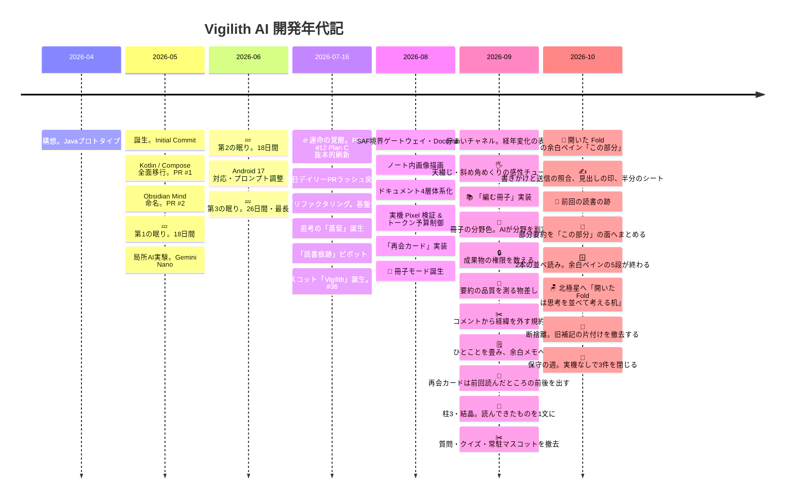

# プロジェクト年表

**プロジェクト:** Vigilith AI（旧 Obsidian Mind）
**作成日:** 2026-09-08 / **更新:** 2026-10-06
**位置づけ:** オーナーの依頼に基づき、Git のコミットと PR 履歴から編纂した開発年代記。
**原点記録:** [09_project_origin.md](09_project_origin.md)
**現状解析:** [01_source_code_analysis.md](01_source_code_analysis.md)

---

## 1. 開発の背景と原動力

本プロジェクトは、次の3つの衝動から生まれた。

1. **Pixel 10 Pro Fold の真の活用。**
   手に入れた折りたたみ端末の開いた大画面を、ただのスマホではなく「思考をめくる極上の文庫本・知的生産ギア」へ昇華させたいという執念。
2. **完全オンデバイス・ローカル LLM へのこだわり。**
   ネットワーク権限を遮断し、端末内の Gemini Nano を駆使して、電波の届かない場所でも完全にプライベートな空間で自己のノート群と対話する。
3. **本業の合間・隙間時間での極限クラフトマンシップ。**
   限られた時間の中で、泥臭い Android の Storage Access Framework と真正面から対峙し、1,500件超の JVM テストと厳密なドキュメント体系を築き上げた。

---

## 2. 全体タイムライン

---

## 3. 年代別詳細記録

### 第1期：黎明期・最初の一歩。2026年4月末〜5月中旬
> **「Javaのノートアプリ構想から、モダンAndroidへの転生」**

| 日付 | 出来事 | 詳細 |
|---|---|---|
| **2026-04-30** | **プロジェクト原点** | [09_project_origin.md](09_project_origin.md) に記録。Java で Obsidian Vault を選んでランダム表示する最小プロトタイプを作成 |
| **2026-05-10** | **Initial Commit** | Git リポジトリ開設 |
| **2026-05-10** | **PR #1: Jetpack Compose 移行** | Java 実装から Kotlin＋Jetpack Compose へ全面マイグレーション |
| **2026-05-11** | **PR #2・#3: リネーム** | パッケージ構造を刷新し、正式名称を「Obsidian Mind」へ |

---

### 第2期：実験と沈黙の期間。2026年5月中旬〜7月中旬
> **「局所的なAI実験と、アイデアを熟成させる長い眠り」**

| 日付 | 出来事 | 詳細 |
|---|---|---|
| **5/12〜5/29** | 💤 **第1の休眠期。約18日間** | アイデアを寝かせ、方向性を模索する沈黙の期間 |
| **2026-05-30** | **PR #5: 局所AI実験の開始** | `local_ai` パッケージ新設。オンデバイス LLM の呼び出し実験がスタート |
| **2026-05-31** | **PR #6・#8・#9: 関連ノート・Q&A** | 類似度 Top-5 ノート推薦、暗記フラッシュカード、グラフビュー等の実験的機能を週末に一挙投入 |
| **6/01〜6/18** | 💤 **第2の休眠期。約18日間** | 再び沈黙 |
| **2026-06-19** | **PR #10・#11: メンテナンス** | Android 17 対応とプロンプト強化 |
| **6/20〜7/15** | 💤 **第3の休眠期。約26日間** | プロジェクト最長の沈黙。構想が水面下で研ぎ澄まされていた期間 |

---

### 第3期：本格点火・疾風怒濤の刷新。2026年7月中旬〜7月末
> **「2026年7月16日、すべてが変わった。連日PRラッシュの覚醒へ」**

| 日付 | 出来事 | 詳細 |
|---|---|---|
| **2026-07-16** | 🔥 **PR #12: Plan C 画面構成の抜本的刷新** | 運命の覚醒日。全体ナビゲーションをタブ構造に再設計。ここから現在まで1日も止まらない開発エンジンに点火 |
| **2026-07-19** | **PR #16〜#21: メガリファクタリング** | `NoteRepository`、`MarkdownProcessor`、`LocalAiModelRepository` を次々と分離・抽象化 |
| **2026-07-21** | **PR #27〜#29: 多段の関連ノートAI** | 関連ノート検出を複数フェーズ化し、ローカルAIの応答速度と推薦品質を両立 |
| **2026-07-22** | **PR #32: 「蒸留」誕生** | 単なる要約ではなく、思考の要点を抽出しノート本文を太字修飾する「蒸留」が中核機能として誕生 |
| **2026-07-25** | **PR #33〜#35: 読書痕跡へのピボット** | 「TimeCapsule」から、ノートとの向き合い方を蓄積する「読書痕跡」へ設計思想を転換 |
| **2026-07-26** | 🤖 **PR #36: Vigilith キャラクター誕生** | 画面に梟のマスコットを常駐化。AIの状態を身体性をもって表現する象徴となる |

---

### 第4期：堅牢化・ゲートウェイ・実機品質の確立。2026年8月
> **「泥臭いAndroidの壁を突破し、実機検証とドキュメントを確立」**

| 日付 | 出来事 | 詳細 |
|---|---|---|
| **2026-08-01** | **PR #45〜#48: SAF境界ゲートウェイ** | SAF を安全に操るため、`DocumentRef` と孤立ファイル清掃機構を完備 |
| **2026-08-03** | **PR #52: Wikilink 画像レンダリング** | Markdown 内の `![[image.png]]` をローカル SAF 経由で安全・高速にインライン描画 |
| **2026-08-11** | **PR #57: ドキュメント4層体系化** | 設計資産の爆発に伴い、`docs/` を `owner/`・`dev/`・`review/`・`_wip/` に構造化 |
| **2026-08-20** | **PR #60・#61: 実機 Pixel 検証 & 再会カード** | 実機での AI 蒸留テストをパス。トークン予算制御と、忘れていた思考と再会する「再会カード」を実装 |

---

### 第5期：手触りと感性の極致・「冊子」時代。2026年8月末〜9月上旬
> **「デジタルのノートビューアから、思考をめくる『紙の冊子』へ」**

| 日付 | 出来事 | 詳細 |
|---|---|---|
| **2026-08-30** | 📖 **PR #64: 冊子モード誕生** | ノートを10枚の束としてZINEのように通読する「冊子モード」を実装 |
| **2026-09-01** | **PR #65: 「佇まいチャネル」策定** | [bearing_channels](../dev/system/bearing_channels.md) を策定。色は年代、形は面の役割、動きは出来事の強度、と意味を1対1に固定 |
| **2026-09-03〜06** | 🖐️ **PR #66・#67: 紙めくりの感性チューニング** | 横送りから天綴じの半回転、そして折り目が斜めに走るめくりへ4度作り替え。620msの余韻に落ち着く |
| **2026-09-07** | 📚 **PR #68: 思考を綴じる「編む冊子」** | 開いているノートを種にしてAIの推薦から束ね、2つの束を行き来する「編む冊子」を実装 |
| **2026-09-08** | **PR #69: 編む冊子を受理、実機検証の簡易版** | 利用枠切れで中断した実機検証を安くするため、通すケースを絞る簡易版と一時テストの残留検査を置く。教訓65件を棚卸し |

---

### 第6期：測る・出す・減らす。2026年9月中旬
> **「作る速度ではなく、効いたと言える状態と出せる状態へ寄せる」**

| 日付 | 出来事 | 詳細 |
|---|---|---|
| **2026-09-09〜12** | 🎨 **PR #70: 冊子の分野色と起動ガード** | フォルダ名を手がかりに暫定の色を付け、ノートを開いたときにAIが固定リストから分野を選んで確定へ昇格。確定は端末へ永続。設計レビュー3巡・実装レビュー4巡を経て実機受理。同じPRでランチャー再タップの重複起動を畳んだ |
| **2026-09-11** | **Fable 5.1 の評価報告書** | コード・文書・git 履歴を8軸で採点。課題候補29件を出し、`_wip/` の特別枠で処遇を決める運用へ |
| **2026-09-12** | **PR #71: 文書費用を減らす3手と分担表** | ヘッダの縮約・設計書の経緯移送・教訓の閾値を「2度目」へ。オーナー／Claude／Codex の分担表を CLAUDE.md へ置き、`system/` 6本を実装と全文突合 |
| **2026-09-12〜13** | 🔒 **PR #72: 成果物の権限を数える** | 推移依存が持ち込んでいた `INTERNET`・`ACCESS_NETWORK_STATE` をマージ後マニフェストから除き、期待集合と双方向で突き合わせる Gradle 検査を置いた。バックアップ除外の走査検査も同時に |
| **2026-09-13〜14** | 📏 **PR #73: 要約の品質を測る物差し** | 固定コーパス9本と採点器を `src/debug` に置き、実機の Nano 出力38文にラベルを付けて較正。AICore が12回成功の直後に13回目を断る境界を観測 |
| **2026-09-14** | ✂️ **PR #74: コメントから経緯を外す** | コメント密度28%の検討から、経緯はコミットが持つと決めた。宙に浮いたKDoc 15箇所を付け直し、日付と指摘番号を検査で落とす |
| **2026-09-14〜15** | 🧹 **PR #75: 大きい2つを分ける** | 再会カードを `ReadingTraceController` から `ReunionCardController` へ、`BookletScreen` を画面本体・紙1枚・めくりの幾何へ。**移動だけで、振る舞いは変えない**。切り出した先のコメントから経緯も落とした |
| **2026-09-16** | 🔎 **PR #76・#77: 検査の穴とピッカーのID契約** | 経緯の検査が文字列リテラルの中の記号を読んでいた件を字句解析で塞ぎ、枝番の無いレビュー番号も落とすようにした。AIピッカーは候補をIDで提示してIDだけ受理する形へ変え、言い換えや翻訳で候補が黙って落ちないようにした |
| **2026-09-17〜18** | 💾 **PR #79: 要約を端末に保存する** | 完成したプロンプトのSHA-256を鍵に `noBackupFilesDir` へ1件1ファイル。**生成は決定的なので、開き直したノートでは作り直さない**。AICore の回数制限で断られたときは SDK の英文ではなく開き直しを促す。当たったかどうかは Debug APK の生成の記録で数え、実機7ケースで受理 |
| **2026-09-18** | ⏳ **自動生成の門番** | 開いた瞬間に走っていた自動生成4本を、**本文が出てから続けて3秒**留まるまで待たせた。冊子から開いてすぐ戻るノートで Nano を使わない。保存済みの要約と生の再会カードは待たせない。実機で3.0秒・初回の要約10.7秒を実測して受理 |

---

### 第7期：Reflect を作り直す。2026年9月下旬
> **「AIが問いを投げるのをやめ、置かれた断片を受け取る側へ回る」**

**引き金はオーナーの体感である。** 9月の開発は眺める体験に集中し、Reflect 側は8月末以降ほぼ動いていなかった。
そのあいだに Reflect の中核だったひとことで不具合が2件出ているが、**どちらも使っていて気づいたのではなく、
コードを読んで／実機ケースを書いて初めて出た。** 使われていない機能の不具合を直すより、形そのものを裏返す判断になった。

**軸は「AIが何をするか」ではなく「ユーザーに何を要求するか」。** 要約＝要求ゼロ、蒸留＝判断3回、
ひとこと＝AIの問いに答える作文。好き嫌いはこの順に並んでいた。

| 日付 | 出来事 | 詳細 |
|---|---|---|
| **2026-09-19** | 🎚️ **PR #81: 蒸留の自由範囲** | 太字にする範囲の両端につまみを出し、親文の内側なら任意の範囲を選べるようにした。**端を置いてよい位置は親文ぶんを全列挙して決める** — 補正を順に当てると1つ目の補正が2つ目の禁止域へ落とす形が残るためで、親文は最大160文字なので全列挙のほうが安い。書記素の判定は `BreakIterator` を使わず自前で数えた。端末とデスクトップJVMで ICU の版が違い、同じ入力へ別の答えを返すためである |
| **2026-09-19〜20** | 🤝 **PR #82・#83: 実機検証の区間を割り直す** | 柱1（自由範囲）を `DIST-25`〜`DIST-31` の実機検証まで通して完了。同じ巡で実機検証の分担を割り直し、**組み立てと片付けはこちら、ケースの判定は Codex** とした。共通手順は185行から282行へ伸びた |
| **2026-09-20** | 🗒️ **柱2: ノートへのひとことを畳み、余白メモを置く** | AIが問いを投げてユーザーが答える形を撤去し、**何にも紐づかない短い断片を何度でも置ける口**へ置き換えた。Reflect 系で唯一、端末AIを1回も呼ばない。専用ルートは無くなり、ボトムシート1枚で完結する。痕跡サイドカーは v7 へ上がり、ひとことの3欄を読み捨てる。**checksum は書かれた版の正規形で検証してから落とす** — 先に落とすと全ファイルが破損扱いになり、訪問履歴まで道連れになる。実装レビュー8件・修正レビュー4件に対応済みで、**実機検証は未了** |
| **2026-09-26** | ✅ **PR #84: 余白メモを実機で通す** | 通し版14ケースと instrumentation 6件が成功し、柱2を完了した。検証待ちだった課題12件が1回の実機検証で一斉に消え、端末で作れない順序の残りにはオーナーが完了の線を引いた |
| **2026-09-26〜27** | 🔁 **再会カードの中身を作り直す** | カードが「24回開いています。最後まで読んでいます」と行動の事実しか伝えず、**何を読んでいたかが分からない**というオーナーの体感から、柱3の前に割り込んだ。途中まで読んだノートには前回いちばん先まで読んだところの前後の要約と「続きから読む」を、読了したノートには当時の問いか要約の先頭1文を出す。訪問履歴しか入力に持たなかった俯瞰要約は撤去し、使われていなかった「まだ考えたい」も外した。低い横画面でカードが本文を隠す件は、その画面だけノート画面を左右2列にして直した。机上レビュー7本と実機検証3巡を2日で回し、**実機でしか出ない欠陥が2件**見つかった。モデルが入力用の記号を復唱する件と、初めて読んだ直後の再会で保存がまだ終わっていない件である。PR #85 でマージ |
| **2026-09-27〜29** | 💎 **柱3: 結晶** | 読んできたノートの保存済みの要約から、別々のノートにまたがる1文を1日に多くて1回作る。当初は本人の文を材料にする構想だったが、置き直した Vault で測ると読んだノートの73%が本の読書メモで、**本人の文の層が薄かった。** 主語を「読んできたもの」へ言い直し、要約を材料にした。AIは候補から材料を選ぶだけで、筋が無ければ何も作らない。生成はノート単位で止め、始まった保存は Vault 単位で完了させる。分野判定に続く2件目のこの形として、設計規約の表を3行へ組み直した。設計レビュー3巡・実装レビュー2巡を経て、実機は7ケース中6件が合格。**実機から新しい不具合は出なかった。** 残る1件は、アプリがローカルの Vault を読む前提の外としてオーナーが閉じた。これで Reflect リニューアルの3本がそろった。PR #86 でマージ |

### 第8期：開いた Fold を本文と余白の2面にする。2026年9月末〜10月上旬

> **「横に広げただけの画面に、反応している本文の隣で書ける場所を置く」**

**引き金は外の壁打ちだった。** 2026-09-28、開いた Fold の読書画面について、
**横に広げただけで、2つの文脈を同時に持てる強みを使えていない**という指摘が出た。実装に当てて確かめると、そのとおりだった。
開発の衝動の1つ目は、折りたたみ端末の開いた大画面を思考の道具にすることである。そこへ正面から戻る形になった。

**足す前に、削った。** 同じ時期にオーナーは3つを外すと決めていた。
質問候補と回答、クイズは、待ったうえで読んで得をする水準に届かず、結果もシートを閉じると消えて次の再会の材料にならない。
常駐マスコットは、読書中に本文の上へ浮き続けて「読むことを妨げない」に反していた。
本文の隣に面を置くなら、その前に場所と入口を空けておく。撤去を「この部分」の前提にした。
設計はオーナーへの grill と設計レビュー5回で固め、正本を起こしてから5つの段に切った。1段1PRで、段ごとに机上ゲートと実機を通す。

| 日付 | 出来事 | 詳細 |
|---|---|---|
| **2026-09-30** | ✂️ **PR #87: 質問・クイズ・常駐マスコットを撤去する** | 部分要約からは質問候補と回答を外して要約だけを残し、入口を見出しの右の 💬 へ移した。クイズは画面も Controller も外し、Snackbar で知らせる機能が1つも無くなった。梟は起動OPにだけ残る。撤去した機能のテスト12クラスも一緒に消えた。通し版8件の実機検証を経て 10-01 にマージ |
| **2026-10-01** | 📖 **PR #88: 段1。本文の右にペインを置く** | 並べ方の判定に余白ペインを足し、`✎` をペインの開閉とシートの出し入れの両方に使えるようにした。**平らに開いた Pixel 10 Pro Fold も縦の折り目を報告する**ことは公式の説明ではなく実機で確かめた。本文の下限320dpでは折り目で割れなかったので、実測から300dpへ下げた。最初の実機検証では、Fold を開閉すると書きかけが窓ごとに別々に戻り、本文が折り目をまたいで不合格になった。書きかけは外殻が本文を形ごとに別の位置で組み立てていたのが原因で、どの形でも同じ位置で組むよう直した。折り目は本文領域の座標へ直してから割り、割れなければ縦に積むようにして、再検証で通した |
| **2026-10-02〜03** | ✍️ **PR #89: 段2。書いた言葉を失わない** | 書きかけと送信の照合、本文の節への追従、見出しの照合と件数の印、本文と併存するスマホのシートを入れた。**受理は件数ではなく、送信の保存値と時刻の組で照合する。** 書きかけは日本語の変換中に崩れないよう、画面の状態の外に置いた。コードのレビューで5件、実機で5つの条件を重ねる間に6件が出た。実機の6件は、閉じたシートが印から開かない、キーボードとシートで本文が消える、Fold を開く方向でフォーカスが外れる、閉じたシートの白い面が下端に覗く、などである。条件5で選抜10行が成功し、確かめていない範囲を段3の実機検証へ持ち越して、オーナーが完了の線を引いた |
| **2026-10-03** | 🔖 **PR #90: 段3。前回の読書の跡** | 前回いちばん深く読んだ節に来ると「前回はここまで読んだ · 9/12」の1行を出す。調べる途中で、**見出しが512バイトを超える節まで読むと、そのノートの訪問が二度と保存されない**不具合が見つかり、同じPRに別のコミットで直した。メモの見出しは整えて保存していたのに、訪問の側だけが取り残されていた。実装レビューでは2件が出た。整形は切った後の末尾の空白を残すので**かけ直すと値が変わる**こと、前回の訪問をメモリの1枠で持つと今の読書に押し出されることである。実機は通し版で新しい不具合が無く、検証側のトークン切れで1度止まったが同じ条件で再開できた。実機で作れない2つの順序は自動テストに任せ、平らに開いたままの回転は段4へ持ち越した。10-03 の夜にマージ |
| **2026-10-04** | 💬 **PR #91: 段4。部分要約を同じ面へまとめる** | 部分要約の専用のシートをやめて「この部分」の面へ移し、ノートを開いている間は最近3節分を持つようにした。全画面の右下の入口を部分要約の 💬 から余白メモの `✎` に替えた。**要約は全画面に入る前のおさらい**という位置づけを、オーナーがここで決めた。実装レビューで4件、再レビューで1件が出た。実機では**シートの「閉じる」が効かない**不具合を見つけた。隠す動きの途中で指がシートに触れると、閉じた扱いなのにシートが画面に残る。隠し終えるまで頼み直す形に直し、同じ手順で成功へ再判定した。13時過ぎにマージ |
| **2026-10-04** | 🪟 **段5: 2本の並べ読み。余白ペインが終わる** | ペインの「このノートの関連」から候補を選ぶと、右がそのノートの本文に替わる。**右は眺めるだけ**で、訪問も要約もメモも動かさない。「このノートへ移る」で、右で読んでいた位置から普通に開ける。実装レビューの2件は、どちらも机上の検査がすり抜けていたものだった。1つは、取り消した後に同期の読み出しが失敗で終わると、その失敗が取り消しより先に届き、閉じた面へ古い候補の失敗が出ること。協調する偽物の読み出しでは、この枝へ一度も届いていなかった。もう1つは、画面を組み直すと戻る先の関連一覧を失うことである。実機は通し版の24行で、新しい不具合は無かった。実機で起こせない2つの順序は確かめないとオーナーが決め、文字を最大にすると並べ読みが出ない制約も受け入れて、5段すべてが終わった。PR #92 として夜にマージ |

### 第9期：机を据え、片付ける。2026年10月上旬

> **「足す前に、何を据えて何を外すかを決める」**

**余白ペインが終わった夜、オーナーは北極星を広げた。** 開いた Fold では、一冊を読む場所が思考を並べて考える机になる。
北極星の文は変えず、再会の対象を1冊のノートから並べて考えた組み合わせへ広げた。
今のノートは主の面の1つだけと決め、机の不変条件と4つの契約を正本に置いた。Next には、机の土台から外画面までの6段が順に入った。

**続く2日は、機能を足さない保守に充てた。** オーナーは保守の週に実機検証をしないと決めた。
削除や純関数のように、受理条件の大半を JVM テストで言える変更に限ったからである。
完了の線は、机上のゲートと Codex のレビューとオーナーの受理で引いた。

| 日付 | 出来事 | 詳細 |
|---|---|---|
| **2026-10-04** | 🪑 **北極星へ「開いた Fold は思考を並べて考える机」を足す** | オーナー自身のコミットで、原則の正本 fold_experience と、今のノートを1つに保つ ADR-0006 を起こした。「ワークステーション」という呼び名は、何でも正当化できるので判断の物差しにしないと決めた |
| **2026-10-05** | 🧹 **PR #93: 断捨離** | 片付ける対象の無くなった旧「AI補記メモを削除」の画面と、それを支える Controller・状態・SAF の口を撤去した。Controller は14本、全画面ルートは5つになった。撤去した返事を前提に書かれていた退避の設計書を今の合流に当て直し、実機の証跡と fixture の原本の置き場も `/tmp` から `evidence/` へ移した。レビューは文書の保証の書き過ぎを1件見つけ、直して修正確認を通した。撤去の見え方はオーナーが自分の端末で確かめた |
| **2026-10-05〜06** | 🔧 **保守の週 No.01** | 3件を1件1コミットで閉じた。先頭に BOM があるノートは、最初の見出しが本文の段落として出ていた。読み込みで BOM を外し、蒸留の書き戻しで元のファイルに合わせて戻す形にした。冊子の扉は、日付だけの行・表の見出し行・ナビの行を飛ばすようにし、手元の Vault で73本の扉が変わった。画面見出しの余白は1つの定数から取るようにし、検査で固定した。レビューは日付の判定が説明の付いた日付まで落とすことを1件見つけ、括弧を曜日だけに限って直した。見出しの霞が左右2列で溝へはみ出す疑いは、触らずに台帳へ起票した。ブランチ `feature/Maintenance_Check_No.01`、PRは未作成 |

---

## 4. 統計で見る「睡眠期」と「覚醒期」の対比

| 期間区分 | 期間 | 日数 | マージPR数 | 開発ペース | 主な特徴 |
|---|---|:---:|:---:|---|---|
| **第1〜2期：睡眠・助走期** | 2026-05-10〜07-15 | 66日間 | 11本 | 約6日に1本。計62日間の沈黙 | 局所的なプロトタイプとアイデア熟成 |
| **第3〜9期：覚醒期** | 2026-07-16〜10-06 | 83日間 | **81本** | **1日1本。連日マージ** | アーキテクチャ刷新・マスコット・冊子・手触り・測る道具・保存・Reflect の作り直し・Fold の余白・机の原則と保守 |

PR番号は #93 まで進み、#38 だけがマージされずに閉じた。コミットは1,128件で、月別では5月23・6月4・7月237・8月363・9月366・10月135。10月は6日までの数である。

**9月は文書のコミットが増えた。** 文書費用がコードと同じ速度で増えている、という
Fable 5.1 の指摘はこの数字に現れ続けている。

**9月下旬に、コードが初めて減った。** ひとことの撤去が本番410行を落とし、余白メモがそれを埋め切らなかった。
**機能を1つ畳んで1つ足したのではなく、AIを1本畳んでAIを呼ばない口へ置き換えた**ためである。
月末の結晶で本番は再び1,667行増えたが、同じ期間にJVMテストも1,639行増え、比はほぼ1対1のままである。

**10月上旬にも本番は減った。** 質問・クイズ・常駐マスコットの撤去が、余白ペインの段1〜3で足した分を上回り、本番は580行減った。
テストは減っていない。JVMテストの件数は22件増え、実機で走らせる instrumentation は786行・26件増えた。
**書いた言葉を扱う面は、端末の上でしか確かめられないことが多い**ためである。

**10月4日の段4と段5で、本番はまた増えた。** 部分要約を面へまとめ、並べ読みを足して本番は771行増え、JVMテストは1,000行・52件増えた。
1日で2段を通せたのは、段1〜3で器と照合の部品が揃っていたからで、段5の本番の増分のうち新しいファイルは3本だけである。

**10月5〜6日の保守で、本番は446行減った。** 旧補記の片付けの撤去が、保守の3件で足した分を上回った。
JVMテストは撤去した Controller の10件を失い、BOM・冊子の扉・見出しの余白で25件を足して、差し引き15件増えた。
**撤去で行が減ることは後退ではない。** 年表の上では、9月下旬・10月上旬に続く3度目の減少である。

---

## 5. 今後の展望：本番コード10万行への道

- 現在のコード規模：約7.2万行。本番 31,117・JVMテスト 34,466・instrumentation 5,924・debug 825。JVMテスト 1,740件
- 目標：**「テストコードを含まない本番コード単体で10万行」**
- 単なる機能の肥大化ではなく、Pixel 10 Pro Fold の折りたたみ大画面を活かした体験の磨き込み、
  オンデバイス AI と人間の思考の対話深化を通じて、唯一無二のクラフトマンシップを体現する
- 9月中旬に方向が1つ足された。**作る速度だけでなく、効いたと言える道具と出せる状態を揃える。**
  要約の物差し・成果物の権限検査・コメントの規約はその最初の3手である
- **9月下旬にもう1つ足された。10万行は足し算だけでは届かない。** Reflect の作り直しは本番コードを減らした。
  **要求の重い機能を畳んで軽い口へ置き換えるほうが、同じ北極星へ近い**という判断である
- **10月上旬に、出発点の衝動へ戻った。** 開いた Fold の大画面を、本文と余白の2面として使い始めた。
  10月4日に5段すべてが終わり、開いた Fold では本文・余白メモ・部分要約・関連ノートを1つの画面で行き来できるようになった。
  閉じた外画面だけの体験は、まだ手付かずである
- **10月上旬の終わりに、道筋が決まった。** 10万行は優先順位の物差しにせず、経験として踏む道で届かせる。
  その道は、開いた Fold を思考を並べて考える机にする6段である。机の土台・見開きの冊子・面を越える引用・机の記憶・知識索引・卓上の形と外画面の順で、
  状態の復元・端末内のDB・姿勢といった、まだ踏んでいない種類の複雑さがここに並ぶ
