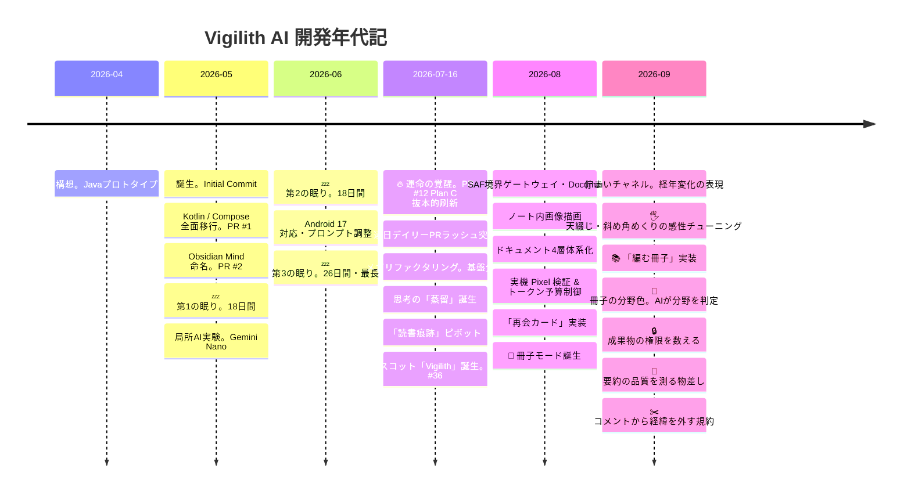

# プロジェクト年表

**プロジェクト:** Vigilith AI（旧 Obsidian Mind）
**作成日:** 2026-09-08 / **更新:** 2026-09-18
**位置づけ:** オーナーの依頼に基づき、Git のコミットと PR 履歴から編纂した開発年代記。
**原点記録:** [project_origin.md](project_origin.md)
**現状解析:** [source_code_analysis.md](source_code_analysis.md)

---

## 1. 開発の背景と原動力

本プロジェクトは、次の3つの衝動から生まれた。

1. **Pixel 10 Pro Fold の真の活用。**
   手に入れた折りたたみ端末の開いた大画面を、ただのスマホではなく「思考をめくる極上の文庫本・知的生産ギア」へ昇華させたいという執念。
2. **完全オンデバイス・ローカル LLM へのこだわり。**
   ネットワーク権限を遮断し、端末内の Gemini Nano を駆使して、電波の届かない場所でも完全にプライベートな空間で自己のノート群と対話する。
3. **本業の合間・隙間時間での極限クラフトマンシップ。**
   限られた時間の中で、泥臭い Android の Storage Access Framework と真正面から対峙し、1,400件超の JVM テストと厳密なドキュメント体系を築き上げた。

---

## 2. 全体タイムライン

---

## 3. 年代別詳細記録

### 第1期：黎明期・最初の一歩。2026年4月末〜5月中旬
> **「Javaのノートアプリ構想から、モダンAndroidへの転生」**

| 日付 | 出来事 | 詳細 |
|---|---|---|
| **2026-04-30** | **プロジェクト原点** | [project_origin.md](project_origin.md) に記録。Java で Obsidian Vault を選んでランダム表示する最小プロトタイプを作成 |
| **2026-05-10** | **Initial Commit** | Git リポジトリ開設 |
| **2026-05-10** | **PR #1: Jetpack Compose 移行** | Java 実装から Kotlin＋Jetpack Compose へ全面マイグレーション |
| **2026-05-11** | **PR #2・#3: リネーム** | パッケージ構造を刷新し、正式名称を「Obsidian Mind」へ |

---

### 第2期：実験と沈黙の期間。2026年5月中旬〜7月中旬
> **「局所的なAI実験と、アイデアを熟成させる長い眠り」**

| 日付 | 出来事 | 詳細 |
|---|---|---|
| **5/12〜5/29** | 💤 **第1の休眠期。約18日間** | アイデアを寝かせ、方向性を模索する沈黙の期間 |
| **2026-05-30** | **PR #5: 局所AI実験の開始** | `local_ai` パッケージ新設。オンデバイス LLM の呼び出し実験がスタート |
| **2026-05-31** | **PR #6・#8・#9: 関連ノート・Q&A** | 類似度 Top-5 ノート推薦、暗記フラッシュカード、グラフビュー等の実験的機能を週末に一挙投入 |
| **6/01〜6/18** | 💤 **第2の休眠期。約18日間** | 再び沈黙 |
| **2026-06-19** | **PR #10・#11: メンテナンス** | Android 17 対応とプロンプト強化 |
| **6/20〜7/15** | 💤 **第3の休眠期。約26日間** | プロジェクト最長の沈黙。構想が水面下で研ぎ澄まされていた期間 |

---

### 第3期：本格点火・疾風怒濤の刷新。2026年7月中旬〜7月末
> **「2026年7月16日、すべてが変わった。連日PRラッシュの覚醒へ」**

| 日付 | 出来事 | 詳細 |
|---|---|---|
| **2026-07-16** | 🔥 **PR #12: Plan C 画面構成の抜本的刷新** | 運命の覚醒日。全体ナビゲーションをタブ構造に再設計。ここから現在まで1日も止まらない開発エンジンに点火 |
| **2026-07-19** | **PR #16〜#21: メガリファクタリング** | `NoteRepository`、`MarkdownProcessor`、`LocalAiModelRepository` を次々と分離・抽象化 |
| **2026-07-21** | **PR #27〜#29: 多段の関連ノートAI** | 関連ノート検出を複数フェーズ化し、ローカルAIの応答速度と推薦品質を両立 |
| **2026-07-22** | **PR #32: 「蒸留」誕生** | 単なる要約ではなく、思考の要点を抽出しノート本文を太字修飾する「蒸留」が中核機能として誕生 |
| **2026-07-25** | **PR #33〜#35: 読書痕跡へのピボット** | 「TimeCapsule」から、ノートとの向き合い方を蓄積する「読書痕跡」へ設計思想を転換 |
| **2026-07-26** | 🤖 **PR #36: Vigilith キャラクター誕生** | 画面に梟のマスコットを常駐化。AIの状態を身体性をもって表現する象徴となる |

---

### 第4期：堅牢化・ゲートウェイ・実機品質の確立。2026年8月
> **「泥臭いAndroidの壁を突破し、実機検証とドキュメントを確立」**

| 日付 | 出来事 | 詳細 |
|---|---|---|
| **2026-08-01** | **PR #45〜#48: SAF境界ゲートウェイ** | SAF を安全に操るため、`DocumentRef` と孤立ファイル清掃機構を完備 |
| **2026-08-03** | **PR #52: Wikilink 画像レンダリング** | Markdown 内の `![[image.png]]` をローカル SAF 経由で安全・高速にインライン描画 |
| **2026-08-11** | **PR #57: ドキュメント4層体系化** | 設計資産の爆発に伴い、`docs/` を `owner/`・`dev/`・`review/`・`_wip/` に構造化 |
| **2026-08-20** | **PR #60・#61: 実機 Pixel 検証 & 再会カード** | 実機での AI 蒸留テストをパス。トークン予算制御と、忘れていた思考と再会する「再会カード」を実装 |

---

### 第5期：手触りと感性の極致・「冊子」時代。2026年8月末〜9月上旬
> **「デジタルのノートビューアから、思考をめくる『紙の冊子』へ」**

| 日付 | 出来事 | 詳細 |
|---|---|---|
| **2026-08-30** | 📖 **PR #64: 冊子モード誕生** | ノートを10枚の束としてZINEのように通読する「冊子モード」を実装 |
| **2026-09-01** | **PR #65: 「佇まいチャネル」策定** | [bearing_channels](../dev/system/bearing_channels.md) を策定。色は年代、形は面の役割、動きは出来事の強度、と意味を1対1に固定 |
| **2026-09-03〜06** | 🖐️ **PR #66・#67: 紙めくりの感性チューニング** | 横送りから天綴じの半回転、そして折り目が斜めに走るめくりへ4度作り替え。620msの余韻に落ち着く |
| **2026-09-07** | 📚 **PR #68: 思考を綴じる「編む冊子」** | 開いているノートを種にしてAIの推薦から束ね、2つの束を行き来する「編む冊子」を実装 |
| **2026-09-08** | **PR #69: 編む冊子を受理、実機検証の簡易版** | 利用枠切れで中断した実機検証を安くするため、通すケースを絞る簡易版と一時テストの残留検査を置く。教訓65件を棚卸し |

---

### 第6期：測る・出す・減らす。2026年9月中旬
> **「作る速度ではなく、効いたと言える状態と出せる状態へ寄せる」**

| 日付 | 出来事 | 詳細 |
|---|---|---|
| **2026-09-09〜12** | 🎨 **PR #70: 冊子の分野色と起動ガード** | フォルダ名を手がかりに暫定の色を付け、ノートを開いたときにAIが固定リストから分野を選んで確定へ昇格。確定は端末へ永続。設計レビュー3巡・実装レビュー4巡を経て実機受理。同じPRでランチャー再タップの重複起動を畳んだ |
| **2026-09-11** | **Fable 5.1 の評価報告書** | コード・文書・git 履歴を8軸で採点。課題候補29件を出し、`_wip/` の特別枠で処遇を決める運用へ |
| **2026-09-12** | **PR #71: 文書費用を減らす3手と分担表** | ヘッダの縮約・設計書の経緯移送・教訓の閾値を「2度目」へ。オーナー／Claude／Codex の分担表を CLAUDE.md へ置き、`system/` 6本を実装と全文突合 |
| **2026-09-12〜13** | 🔒 **PR #72: 成果物の権限を数える** | 推移依存が持ち込んでいた `INTERNET`・`ACCESS_NETWORK_STATE` をマージ後マニフェストから除き、期待集合と双方向で突き合わせる Gradle 検査を置いた。バックアップ除外の走査検査も同時に |
| **2026-09-13〜14** | 📏 **PR #73: 要約の品質を測る物差し** | 固定コーパス9本と採点器を `src/debug` に置き、実機の Nano 出力38文にラベルを付けて較正。AICore が12回成功の直後に13回目を断る境界を観測 |
| **2026-09-14** | ✂️ **PR #74: コメントから経緯を外す** | コメント密度28%の検討から、経緯はコミットが持つと決めた。宙に浮いたKDoc 15箇所を付け直し、日付と指摘番号を検査で落とす |
| **2026-09-14〜15** | 🧹 **PR #75: 大きい2つを分ける** | 再会カードを `ReadingTraceController` から `ReunionCardController` へ、`BookletScreen` を画面本体・紙1枚・めくりの幾何へ。**移動だけで、振る舞いは変えない**。切り出した先のコメントから経緯も落とした |
| **2026-09-16** | 🔎 **PR #76・#77: 検査の穴とピッカーのID契約** | 経緯の検査が文字列リテラルの中の記号を読んでいた件を字句解析で塞ぎ、枝番の無いレビュー番号も落とすようにした。AIピッカーは候補をIDで提示してIDだけ受理する形へ変え、言い換えや翻訳で候補が黙って落ちないようにした |
| **2026-09-17〜18** | 💾 **PR #79: 要約を端末に保存する** | 完成したプロンプトのSHA-256を鍵に `noBackupFilesDir` へ1件1ファイル。**生成は決定的なので、開き直したノートでは作り直さない**。AICore の回数制限で断られたときは SDK の英文ではなく開き直しを促す。当たったかどうかは Debug APK の生成の記録で数え、実機7ケースで受理 |
| **2026-09-18** | ⏳ **自動生成の門番** | 開いた瞬間に走っていた自動生成4本を、**本文が出てから続けて3秒**留まるまで待たせた。冊子から開いてすぐ戻るノートで Nano を使わない。保存済みの要約と生の再会カードは待たせない。実機で3.0秒・初回の要約10.7秒を実測して受理 |

---

## 4. 統計で見る「睡眠期」と「覚醒期」の対比

| 期間区分 | 期間 | 日数 | マージPR数 | 開発ペース | 主な特徴 |
|---|---|:---:|:---:|---|---|
| **第1〜2期：睡眠・助走期** | 2026-05-10〜07-15 | 66日間 | 11本 | 約6日に1本。計62日間の沈黙 | 局所的なプロトタイプとアイデア熟成 |
| **第3〜6期：覚醒期** | 2026-07-16〜09-18 | 65日間 | **67本** | **1日1本。連日マージ** | アーキテクチャ刷新・マスコット・冊子・手触り・測る道具・保存 |

PR番号は #79 まで進み、#38 だけがマージされずに閉じた。コミットは860件で、月別では5月23・6月4・7月237・8月363・9月233。

**9月は文書のコミットが増えた。** 09-14 以降の65コミットのうちコードに触れたのは19件で、残り46件は文書だけである。
文書費用がコードと同じ速度で増えている、という Fable 5.1 の指摘はこの数字に現れ続けている。

---

## 5. 今後の展望：本番コード10万行への道

- 現在のコード規模：約6.5万行。本番 29,102・JVMテスト 30,662・instrumentation 4,109・debug 826。JVMテスト 1,525件
- 目標：**「テストコードを含まない本番コード単体で10万行」**
- 単なる機能の肥大化ではなく、Pixel 10 Pro Fold の折りたたみ大画面を活かした体験の磨き込み、
  オンデバイス AI と人間の思考の対話深化を通じて、唯一無二のクラフトマンシップを体現する
- 9月中旬に方向が1つ足された。**作る速度だけでなく、効いたと言える道具と出せる状態を揃える。**
  要約の物差し・成果物の権限検査・コメントの規約はその最初の3手である
