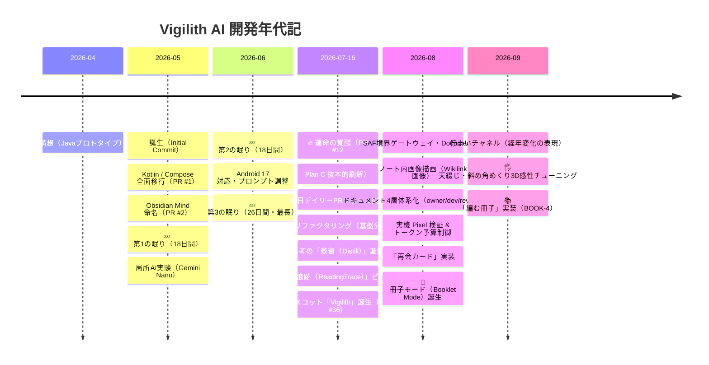

# プロジェクト年表（Project Chronology）

**プロジェクト:** Vigilith AI（旧 Obsidian Mind）  
**作成日:** 2026-09-08  
**位置づけ:** オーナーの依頼に基づき、Git コミットおよび PR 履歴から編纂した開発年代記。  
**原点記録:** [project_origin.md](project_origin.md)  
**現状解析:** [source_code_analysis.md](source_code_analysis.md)

---

## 1. 開発の背景と原動力

本プロジェクトは、以下の強い衝動とハードウェアへの愛から生まれた。

1. **Pixel Fold 10（折りたたみスマホ）の真の活用**  
   手に入れた折りたたみ端末の開いた大画面を、ただのスマホではなく「思考をめくる極上の文庫本・知的生産ギア」へ昇華させたいという強い執念。
2. **完全オンデバイス・ローカル LLM へのこだわり**  
   ネットワーク権限を遮断し、端末内の Gemini Nano を駆使して、電波の届かない場所でも完全にプライベートな空間で自己のノート群と対話する。
3. **本業の合間・隙間時間での極限クラフトマンシップ**  
   限られた時間の中でありながら、泥臭い Android の Storage Access Framework (SAF) 仕様と真正面から対峙し、1,200件超の JVM テストと厳密なドキュメント体系を築き上げた。

---

## 2. 全体タイムライン

---

## 3. 年代別詳細記録

### 第1期：黎明期・最初の一歩（2026年4月末 〜 5月中旬）
> **「Javaのノートアプリ構想から、モダンAndroidへの転生」**

| 日付 | 出来事 / コミット・PR | 詳細 |
|---|---|---|
| **2026-04-30** | **プロジェクト原点** | [project_origin.md](project_origin.md) に記録。Java で Obsidian Vault を選んでランダム表示する最小プロトタイプを作成。 |
| **2026-05-10** | **Initial Commit** | Git リポジトリ開設。 |
| **2026-05-10** | **PR #1: Jetpack Compose 移行** | Java 実装から Kotlin + Jetpack Compose へ全面マイグレーションを敢行。 |
| **2026-05-11** | **PR #2 & #3: リネーム** | パッケージ構造を刷新し、正式名称を**「Obsidian Mind」**へ決定。 |

---

### 第2期：実験と沈黙の期間（睡眠期）（2026年5月中旬 〜 7月中旬）
> **「局所的なAI実験と、アイデアを熟成させる長い眠り」**

| 日付 | 出来事 / コミット・PR | 詳細 |
|---|---|---|
| **5/12 〜 5/29** | 💤 **第1の休眠期（約18日間）** | アイデアを寝かせ、方向性を模索する沈黙の期間。 |
| **2026-05-30** | **PR #5: 局所AI実験の開始** | `local_ai` パッケージ新設。オンデバイス LLM（Gemini Nano）呼び出しの実験がスタート。 |
| **2026-05-31** | **PR #6, #8, #9: 関連ノート・Q&A** | 類似度 Top-5 ノート推薦、暗記フラッシュカード、グラフビュー等の実験的機能を週末に一挙投入。 |
| **6/01 〜 6/18** | 💤 **第2の休眠期（約18日間）** | 再び沈黙。 |
| **2026-06-19** | **PR #10, #11: メンテナンス** | Android 17（Baklava preview）対応とプロンプト強化を行う。 |
| **6/20 〜 7/15** | 💤 **第3の休眠期（約26日間）** | **プロジェクト最長の沈黙。** 構想が水面下で深く研ぎ澄まされていた期間。 |

---

### 第3期：本格点火・疾風怒濤の刷新（2026年7月中旬 〜 7月末）
> **「2026年7月16日、すべてが変わった。連日PRラッシュの覚醒へ」**

| 日付 | 出来事 / コミット・PR | 詳細 |
|---|---|---|
| **2026-07-16** | 🔥 **PR #12: Plan C 画面構成の抜本的刷新** | **運命の覚醒日。** 全体ナビゲーションをタブ構造に再設計。ここから現在まで**1日も止まらない猛烈な開発エンジン**に点火。 |
| **2026-07-19** | **PR #16〜#21: メガリファクタリング** | `NoteRepository`、`MarkdownProcessor`、`LocalAiModelRepository` を次々と分離・抽象化。 |
| **2026-07-21** | **PR #27〜#29: Multi-phase Related AI** | 関連ノート検出を複数フェーズ化し、ローカルAIの応答速度と推薦品質を両立。 |
| **2026-07-22** | **PR #32: 「蒸留（Distillation）」誕生** | 単なる要約ではなく、思考の要点を抽出しノート本文を太字修飾する「蒸留」が中核機能として誕生。 |
| **2026-07-25** | **PR #33〜#35: 読書痕跡へのピボット** | 単なる「TimeCapsule」から、ノートとの向き合い方を蓄積する**「読書痕跡（ReadingTrace）」**へ設計思想を転換。 |
| **2026-07-26** | 🤖 **PR #36: Vigilith キャラクター誕生** | 画面に梟のマスコット「Vigilith」を常駐化。AIの状態を身体性をもって表現する象徴となる。 |

---

### 第4期：堅牢化・ゲートウェイ・実機品質の確立（2026年8月上旬 〜 8月下旬）
> **「泥臭いAndroidの壁を突破し、実機検証とドキュメントを確立」**

| 日付 | 出来事 / コミット・PR | 詳細 |
|---|---|---|
| **2026-08-01** | **PR #45〜#48: SAF境界ゲートウェイ** | Android の SAF を安全に操るため、`DocumentRef` と孤立ファイル清掃機構を完備。 |
| **2026-08-03** | **PR #52: Wikilink 画像レンダリング (N-3)** | Markdown 内の `![[image.png]]` をローカル SAF 経由で安全・高速にインライン描画。 |
| **2026-08-11** | **PR #57: ドキュメント4層体系化** | 設計資産の爆発に伴い、`docs/` を `owner/`・`dev/`・`review/`・`_wip/` に厳密に構造化。 |
| **2026-08-20** | **PR #60, #61: 実機 Pixel 検証 & 再会カード (X-2)** | 実機 Google Pixel での AI 蒸留テストをパス。トークン予算制御（X-5）と、忘れていた思考と再会する「再会カード」を実装。 |

---

### 第5期：手触りと感性の極致・「冊子」時代（2026年8月末 〜 9月現在）
> **「デジタルのノートビューアから、思考をめくる『紙の冊子』へ」**

| 日付 | 出来事 / コミット・PR | 詳細 |
|---|---|---|
| **2026-08-30** | 📖 **PR #64: 冊子モード誕生 (N-12)** | ノートを10枚の束としてZINEのように通読する「冊子モード（Booklet Mode）」が実装。 |
| **2026-09-01** | **PR #65: 「佇まいチャネル」策定** | [bearing_channels.md](../dev/bearing_channels.md) を策定。ノートの経過年数に応じた紙の質感・経年変化を視覚表現へ落とし込む。 |
| **2026-09-03〜06** | 🖐️ **PR #66, #67: 究極の紙めくり感性チューニング** | 「天綴じ」「斜め角めくり」「620msの心地よい余韻」「3Dパースペクティブ」など、徹底的に触覚に訴えかける微調整を実施。 |
| **2026-09-07** | 📚 **PR #68: 思考を綴じる「編む冊子」 (BOOK-4)** | 開いているノートを種にしてAIが束ね、2つの束を行き来する「編む冊子」を実装。 |

---

## 4. 統計で見る「睡眠期」と「覚醒期」の対比

| 期間区分 | 期間 | 日数 | マージPR数 | 開発ペース | 主な特徴 |
|---|---|:---:|:---:|---|---|
| **第1〜2期：睡眠・助走期** | 2026-05-10 〜 2026-07-15 | 66日間 | 11本 | 約6日に1本（計62日間の沈黙） | 局所的なプロトタイプとアイデア熟成 |
| **第3〜5期：フルスロットル覚醒期** | 2026-07-16 〜 2026-09-08 | 54日間 | **57本以上** | **1日1本以上（連日マージ）** | アーキテクチャ刷新・マスコット・冊子・手触りチューニング |

---

## 5. 今後の展望：本番コード10万行への道

- 現在のコード規模：約5.8万行（JVMテスト 1,293件を含む堅牢な基盤）。
- 目標：**「テストコードを含まない本番コード単体で10万行」**。
- 単なる機能の肥大化ではなく、Pixel Fold の折りたたみ大画面を活かした体験の磨き込み、オンデバイス AI と人間の思考の対話深化を通じて、唯一無二のクラフトマンシップを体現する。
